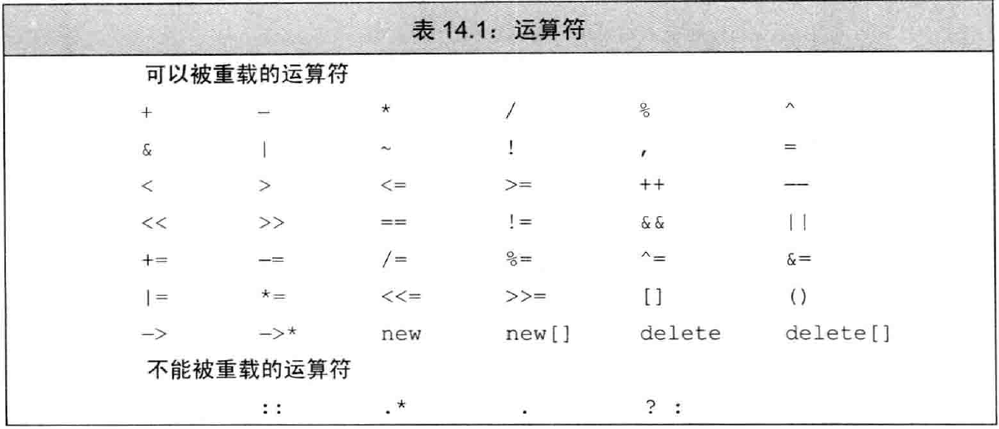

= 第十四章  重载运算符与类型转换
ifdef::env-github[]
:imagesdir:
 https://gist.githubusercontent.com/path/to/gist/revision/dir/with/all/images
:tip-caption: :bulb:
:note-caption: :information_source:
:important-caption: :heavy_exclamation_mark:
:caution-caption: :fire:
:warning-caption: :warning:
endif::[]
ifndef::env-github[]
:imagesdir: ./
endif::[]
:toc:
:toc-placement!:

toc::[]

# 基本概念

* 重载运算符: 由关键字 `operator` 和其后要定义的运算符共同组成
* 重载运算符函数的参数数量与该运算符作用的运算对象数量一致。除了重载的函数调用运算符 `operator()` 之外，其它重载运算符不能含有默认参。
** 可以从运算符函数的参数数量判断（ `+ , - , \* , &` ）是一元操作符还是二元操作符
* 运算符函数，要么是类的成员，要么至少含有一个类类型的参数

[NOTE]
====
当一个重载的运算符是成员函数时，`this` 绑定到左侧运算对象。成员运算符函数的（显式）参数数量比运算符的运算对象总数少一个。
====

CAUTION: 通常情况下，不应该重载逗号、取地址、逻辑与、逻辑或运算符。
前两者是因为C++语言已经定义了这两种运算符用于类类型对象时的特殊含义。后两者是因为重载运算符版本无法保持求值顺序和短路性质。

TIP: 尽量明智地使用运算符重载，使得内置的运算符和类操作之间存在逻辑映射关系。 

*直接调用一个重载的运算符函数*

[source,c++]
----
//一个非成员运算符函数的等价调用
//传入data1作为第一个实参，传入data2作为第二个实参
data1 + data2;
operator+(data1,data2);

//显式的调用成员运算符函数
data1 += data2;
data1.operator+=(data2);
----