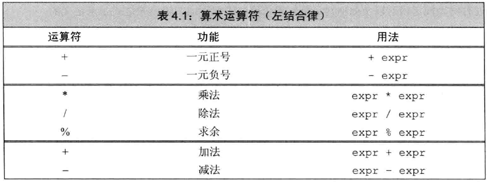
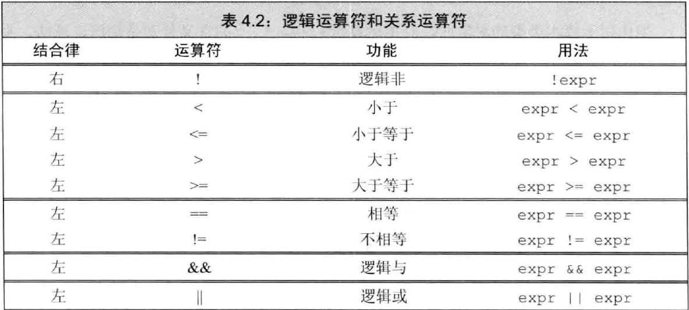

= 第四章  表达式
ifdef::env-github[]
:imagesdir:
 https://gist.githubusercontent.com/path/to/gist/revision/dir/with/all/images
:tip-caption: :bulb:
:note-caption: :information_source:
:important-caption: :heavy_exclamation_mark:
:caution-caption: :fire:
:warning-caption: :warning:
endif::[]
ifndef::env-github[]
:imagesdir: ./
endif::[]
:toc:
:toc-placement!:

toc::[]

# 基础
表达式由一个或多个 *运算对象（operand）* 组成，对表达式求值将得到一个结果。
字面值和变量是最简单的 *表达式（expression）*，其结果就是字面值和变量的值。
把一个 *运算符（operator）* 和多个运算对象组合起来就可以生成复杂的表达式。

## 基本概念
* 根据运算对象的个数划分运算符:

    ** 一元运算符: 取地址符（&\_a_），解引用符（*_a_），一元正负号（+_a_，-_a_）等，优先级最高
    ** 二元运算符: 相等运算符（_a_ == _b_），相乘（_a_ * _b_）等
    ** 三元运算符: _cond_ ? _expr1_ : _expr2_ 等

* *组合运算符* 和 *运算对象*:

    ** *优先级（precedence）*: 优先级从高到低计算；
    ** *结合律（associativity）*: 当运算符优先级一致时，左结合律表示从左往右计算；右结合律表示从右往左计算；
    ** 运算对象的 *求值顺序（order of evaaluation）* 二元或多元运算符的运算对象的计算顺序，即求值顺序。
    ** 运算对象类型转换: 小整数型通常会被提升为大整数型。

* *重载运算符*:

** C++语言定义了运算符作用于内置类型和复合类型的运算对象时所执行的操作。
** 当运算符作用于类类型的运算对象时，用户可以自定义其含义——*重载运算符（overloaded operator）*

* *左值和右值*:

    ** 当对象被用作 *右值* 的时候，用的是 *对象的值（内容）*；当对象被用作 *左值* 的时候，用的是 *对象的身份（在内存中的位置）*。
    ** 不同的运算符对运算对象的要求各不相同，有的需要左值运算对象，有的需要右值运算对象；返回值也有差异，有的得到左值结果，有的得到右值结果。（需要右值的地方可以使用左值来代替，反之不可）
        *** 赋值运算符需要一个（非常量）左值作为其左侧运算对象，得到的结果仍然是一个左值；
        *** 取地址符作用于一个左值运算对象，返回一个指向该运算对象的指针，该指针是个右值；
        *** 内置解引用运算符、下标运算符、迭代器解引用运算符、string和vector的下标运算符的求值结果都是左值。
        *** 内置类型和迭代器的递增递减运算符作用于左值运算对象，所得的结果也是左值。
        *** 如果表达式的求值结果是左值，decltype作用于该表达式（不是变量）得到一个引用类型

[source,c++]
----
int i = 42, *p = &i , &r = i;
decltype(r) a      //错误：a是int&，必须初始化
decltype(r + 0) b; //正确：加法的结果是int，y绑定到变量x
decltype(*p) c;    //错误：c是int&，必须初始化（因为该表达式*p的求值结果可以作为一条赋值语句的左值）
decltype(i) d;     //正确：d是一个（未初始化的）int
decltype((i))) e;  //错误：e是int&，必须初始化
----

WARNING: `decltype\((variable))` 的结果永远是引用，而 `decltype(variable)` 结果只有variable本身就是一个引用时才是引用

## 优先级与结合律

*复合表达式（compound expression）* 是指含有两个或多个运算符的表达式。求复合表达式的值需要首先将运算符和运算对象合理地组合在一起，优先级与结合律决定了运算对象的组合方式。高优先级运算符的运算对象要比低优先级运算符的运算对象更为紧密的结合在一起；如果优先级相同，则其组合律由其结合律决定。括号无视优先级和组合律。

[source,c++]
----
int i = 6 + 3 * 4 / 2 + 2;

int ia[] = {0,2,4,6,8};
int last = *(ia + 4);
cout<<last<<endl;
last = *ia + 4;
cout<<last<<endl;

int v1,v2;
cin >> v1 >> v2; //IO相关的运算符满足左结合律
----

## 求值顺序

优先级规定了运算对象的组合方式，但没有说明运算对象要按照什么顺序求值。大多数情况下，不会明确指定求值的顺序：
[source,c++]
----
int i = f1()*f2(); <1>

int j = 0;
cout << i << " "<< ++i <<endl; <2>
----
<1> f1和f2一定会在执行乘法之前被调用，但是无法知道f1和f2谁先调用
<2> 程序是未定义的，因为无法推断其行为：编译器可能先求+\+i的值再求i的值，此时输出1 1，也可能先求i的值再求++i的值，输出结果为0 1

# 算术运算符

* 表4.1（以及后面章节的运算符表）按照运算符优先级从高到低将其分组；
* 算术运算符的运算对象和求值结果都是 *右值*；
* 所有算数运算符均满足 *左结合律*。

[source,c++]
----
int i = 1024;
int k = -i;
bool b = true;
bool b2 = -b; //b2是true,非零为真，零为假——布尔值不应该参加运算

21 / 6；    /*result = 3 */
21 / 7;     /*result = 3 */
-21 / -8;   /*result = 2 */
21 / -5;    /*result = -4 */    <1>

21 % 6；    /*result = 3 */
21 % 7;     /*result = 0 */
-21 % -8;   /*result = -5 */
21 % -5;    /*result = 1 */    <2>
----

<1> 在整数除法运算中，*商一律向0取整*（即直接切除整数部分）;
<2> 运算符 % 俗称“取余”或“取模”，其运算对象必须为整数。如果m和n是整数且n非0，则m = (m/n)*n + m%n，说明如果m%n != 0时，m%n的符号和m相同。

# 逻辑和关系运算符

* 关系运算符作用于算术类型或指针类型，逻辑运算符能作用域任意能转换为布尔值的类型；
* 逻辑和关系运算符的返回值都是布尔类型，值为0的运算对象（算术类型或指针类型）表示假，否则为真；
* 运算对象和求值结果都是 *右值*。

* *短路求值*（short-circuit evaluation）：当且仅当左侧运算对象无法确定表达式的结果时，才会计算右侧运算对象的值。
** 对于逻辑与运算符（&&），当且仅当左侧运算对象为真时才对右侧运算对象求值；
** 对于逻辑或运算符（||），当且仅当左侧运算对象为假时才对右侧运算对象求值。

TIP: 变量声明为引用类型可以避免对元素的拷贝，例如当string对象非常大时可以节省时间。

[source,c++]
----
//s是对常量的引用；元素既没有被拷贝也不会被改变
for(const auto &s: text){
    cout<<s;
    //遇到空字符串或者以句号结尾的字符串进行换行
    if(s.empty()||s[s.size()-1]=='.')
        cout<<endl;
    else
        cout<<" ";
}
----

# 赋值运算符

赋值运算符的左侧运算对象必须是一个可修改的左值。

[source,c++]
----
int i = 0, j = 0, k = 0;   //初始化而非赋值
const int ci = i;          //初始化而非赋值

1024 = k;                  //错误：字面值是右值
i + j = k;                 //错误：算术表达式是右值
ci = k;                    //错误：ci是常量（不可修改的）左值

k = 0;
k = 3.14159;           <1> //result: 类型是int，值为3

k = {3.14159}          <2> //错误：窄化转换

int ival, jval;
ival = jval = 0;       <3> //正确：均赋值为0   

int ival, *pval;
ival = pval = 0;           //错误：指针类型不能转化为int类型，所以不能把指针的值赋给string对象
string s1, s2;
s1 = s2 = "OK";            //正确：字符串字面值"OK"转换成string对象
----

<1> 赋值运算的结果是其左侧运算对象，并且是一个左值，相应的，结果的类型也是左侧运算对象的类型。如果赋值运算符左右运算对象类型不一致，则将右侧运算对象类型转化为左侧运算对象的类型；
<2> 如果左侧运算对象是内置类型，则初始值列表最多只能包含一个值，且该值即使转化的话其所占空间也不应该大于目标类型的空间；
<3> 赋值运算满足右结合律

* *赋值运算优先级低* : 将赋值语句放在条件语句中，简化逻辑；但要注意使用括号提高赋值运算的优先级。
[source,c++]
----
//形式琐碎，易出错
int i = get_value();    //得到第一个值
while(i != 42){
    //其他处理...
    i = get_value();    //得到剩下的值
}

//更好的写法：条件部分表达更清晰
int i;
while((i = get_value()) != 42){
    //其他处理...
}
----

*切勿混淆相等运算符（==）和赋值运算符（=）:

** C++允许赋值运算作为条件，`if(i = j)` 表示将j赋值给i，然后判断i是否为0，是则false，否则true；
** `if(i == j)` 判断i与j是否相等，是则true，否则false。

*复合赋值运算符*

[source,c++]
----
+=    -=    *=    /=    %=      //算数运算符
<<=   >>=   &=    ^=    |=      //位运算符
---- 

* 任意一种复合运算符完全等价于: `a = a _op_ b`
* 唯一的区别是左侧运算对象的求值次数:
** 使用复合运算符只求求值一次
** 使用普通的运算符求值两次
*** 第一次是作为右边子表达式的一部分求值
*** 第二次是作为赋值运算的左侧运算对象求值

# 递增和递减运算符

*必须作用于左值运算对象
** 前置版本: 将运算对象加1（或减1），然后将运算对象本身作为左值返回，作为求值结果；
** 后置版本: 将对象原始值的副本作为右值返回，作为求值结果，而对象本身加1（或减1）。

CAUTION: 优先使用前置版本，后置版本需要提前存储原始值副本，副本造成浪费（除非需要副本）。

* 在一条语句中混用解引用和递增运算符
** 后置递增运算符的优先级高于解引用运算符: `iter++` 等价于 `*(iter++)`

[source,c++]
----
auto iter = v.begin();
while(iter!=v.end() && *iter >= 0){
    //输出当前值，iter向前移动一个元素
    cout<< *iter++ <<endl;
}

//cout<< *iter++ <<endl;比以下等价语句更简洁，少出错。

//等价语句
//cout<< *iter <<endl;
//++iter;
----

CAUTION: 简洁可以成为一种美德。追求简介，摒弃冗长。

* 运算对象可按任意顺序求值
** 在一个复合表达式中，其中一个子表达式改变了某个运算对象的值，另一个子表达式又要使用该值的话，容易出现二义性，导致未定义错误

[source,c++]
----
for(auto it = s.begin(); it != s.end()&&!isspace(*it); ++it){
    *it = toupper(*it);
}

//如果用一个看似等价的while循环代替，会出现未定义错误
while(it != s.end() && !isspace(*it)){
    *it = toupper(*it++); //错误: 该赋值语句未定义
}
//编译器出现二义性：
*it = toupper(*it);       //如果先求左侧的值
*(it+1) = toupper(*it);   //如果先求右侧的值
----

